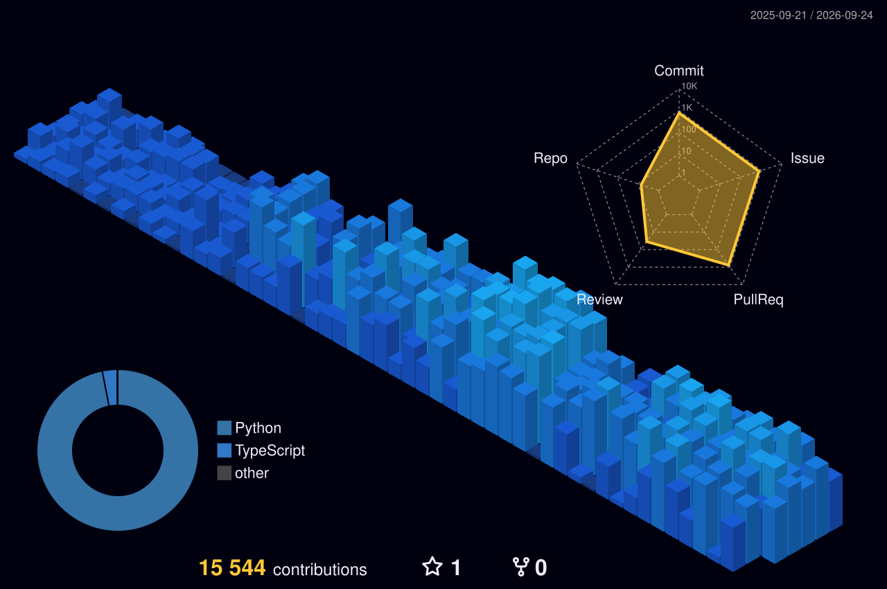
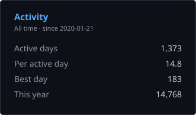

Data Engineer based in Seoul, Korea 🇰🇷

<!-- Generated in this repository by .github/workflows/profile-3d.yml, so it does
     not depend on any third-party renderer staying up. -->

  

<!-- The row is one 
 so the images stay inline and can wrap; a line that
     starts with  would otherwise become its own block and stack.
     Widths are pixels, not percentages: a percentage never wraps, so on a
     phone it squeezes the whole row into one line instead of stacking.
     each card is wider than a phone column so neither leaves a gap.

     The two widths are what make the cards the same height: the sources are
     331x195 and 495x195, so both render at 195px and the tops line up. Their
     sum plus the single space between the tags is the 830 the rows above and
     below use — closing that space costs 4px of alignment.

     The left card is generated in this repository by
     .github/workflows/stats-card.yml. The third-party card it replaced read
     per-type totals (commits, PRs, issues), which count only repositories the
     asking token can see — 11 of 73 here — so it showed 1.1k all-time commits
     beside a streak card reporting 18,938. Both were right about different
     populations. Every row here comes from the contribution calendar instead,
     which answers the same under any token, and none of them repeats a number
     the streak card already prints (#5).

     The streak card's colors are set one by one rather than by a theme name:
     every bundled theme draws a border that does not match the left card's
     #2e343b, and github-dark-blue's is near-white. -->

 

  

