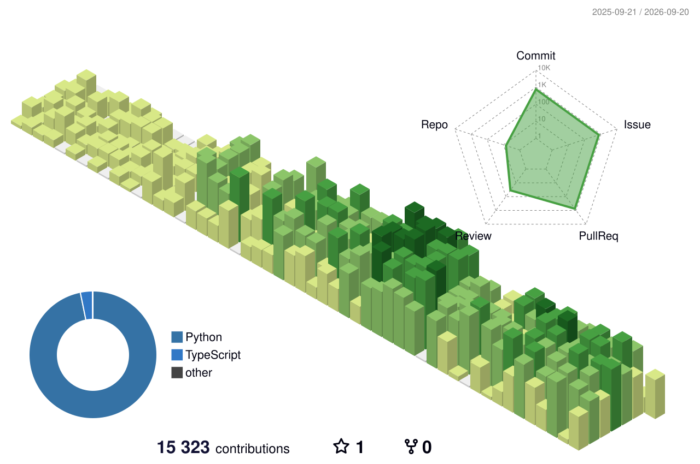

Data Engineer based in Seoul, Korea 🇰🇷

### Contributions

<!-- Generated in this repository by .github/workflows/profile-3d.yml, so it does
     not depend on any third-party renderer staying up. -->

### Stats

### Farm

